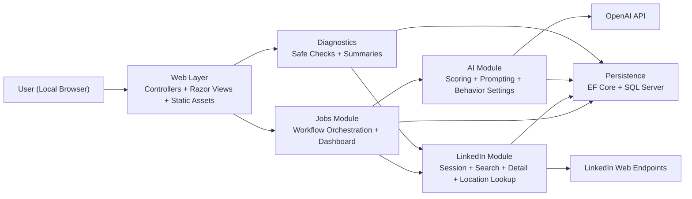
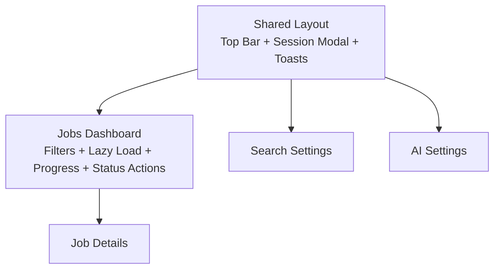

# Architecture Diagram

## Purpose

This document gives reviewers a fast visual map of the current runtime architecture.

It complements:

- `docs/architecture/overview.md`
- `docs/product/roadmap.md`

## Modular Monolith Overview

## UI Interaction Surface

## Runtime Safety Boundaries

- The app remains a single deployable MVC web application.
- Controllers stay thin and delegate orchestration to module services.
- External integrations are isolated in `LinkedIn` and `AI` modules.
- `Diagnostics` is intentionally non-business-critical and should not become a production workflow dependency.
- Sensitive configuration is expected to come from `user-secrets` or environment variables, not tracked config files.
