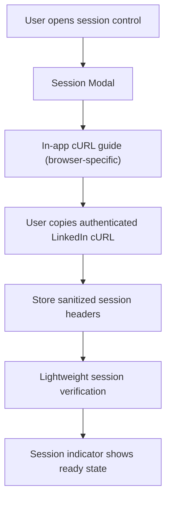
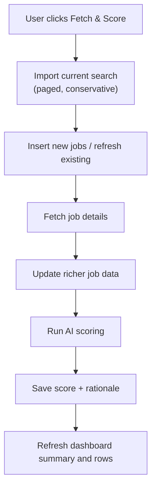
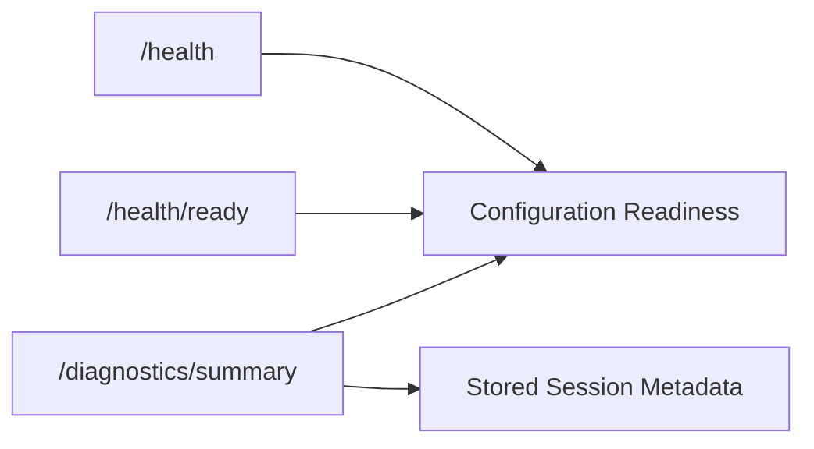

# Data Flow Diagram

## Purpose

This document shows the highest-value runtime flows in a compact visual form.

It is intended for:

- new maintainers
- reviewers
- AI assistants that need flow-level context quickly

## Session Capture Flow

## Fetch & Score Workflow

## Diagnostics and Readiness Flow

## Flow Notes

- Fetching remains conservative by design:
  - explicit page caps
  - explicit job caps
  - deliberate pacing between requests
- `401` from LinkedIn invalidates the current stored session.
- AI scoring is advisory only; it does not replace user workflow decisions.
- The current CI and test posture intentionally avoids live SQL Server, LinkedIn, and OpenAI dependencies.
